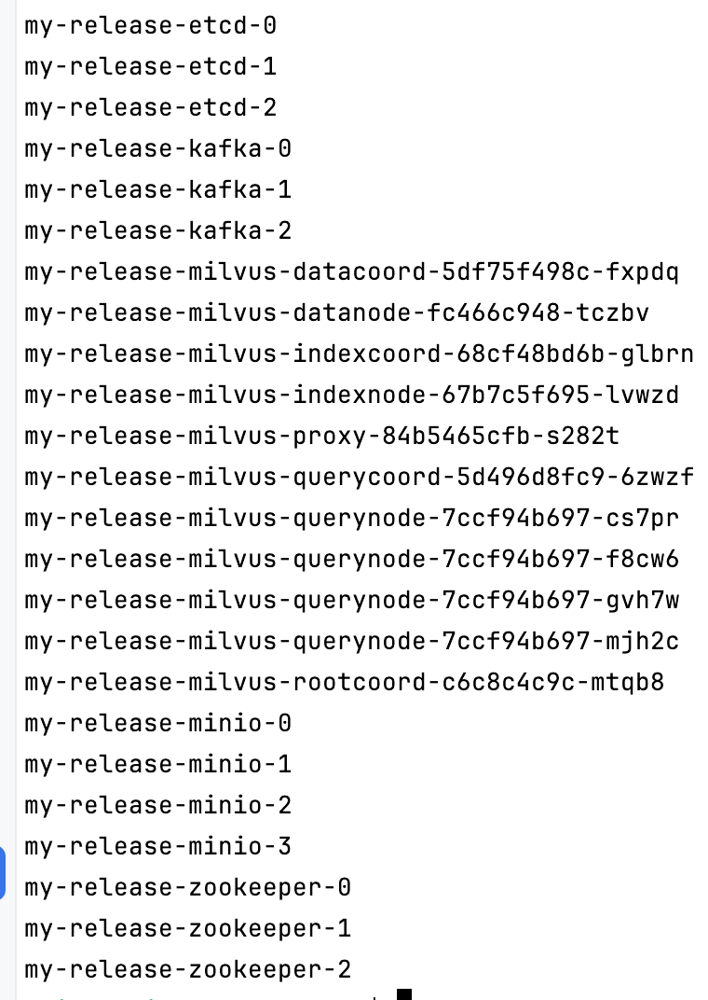
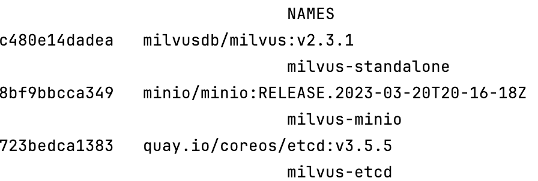

Milvus Notes
===

About Milvus
---

### Index Types

If you do not specify an index type, Milvus will operate brute-force search by default.

- General
    - FLAT
    - IVF_FLAT
    - IVF_SQ8
    - IVF_PQ
    - HNSW
- On-disk
    - DISKANN
- GPU
    - GPU_IVF_FLAT
    - GPU_IVF_PQ
- Binaray
    - BIN_FLAT
    - BIN_IVF_FLAT

### Similarity metrics

- Floating point
    - Euclidean distance (L2)
        - CV
    - Inner product (IP)
        - NLP
    - Cosine similarity (COSINE)
- Binary
    - Hamming
        - NLP
    - Jaccard
        - molecular similarity

### Design

As a cloud-native vector database, Milvus separates storage and computation by design. To enhance elasticity and
flexibility, all components in Milvus are stateless.

The system breaks down into four levels

- Access layer:
    - The access layer is composed of a group of stateless proxies and serves as the front layer of the system and
      endpoint to users.
    - Nginx、Kubernetes Ingress、NodePort和LVS
- Coordinator service:
    - The coordinator service assigns tasks to the worker nodes and functions as the system's brain.
- Worker nodes:
    - The worker nodes function as arms and legs and are dumb executors that follow instructions from the coordinator
      service and execute user-triggered DML/DDL commands.
- Storage:
    - Storage is the bone of the system, and is responsible for data persistence. It comprises meta storage, log broker,
      and object storage.





- DML(Data Manipulation Language)
    - INSERT
    - UPDATE
    - DELETE
    - ...
- DDL(Data Definition Language)
    - CREATE
    - ALTER
    - DROP
    - ...
- DCL(Data Control Language)
    - GRANT
    - REVOKE
    - COMMIT
    - ROLLBACK
    - ...
- etcd
    - et-see-dee
    - distributed key-value store
      notes
- minIO
    - min·eye·oh
    - High Performance Object Storage
      for Modern Data Lakes
    - API compatible with the Amazon S3
- Apache ZooKeeper
    - Apache Hadoop 的一個子項目
    - ?
    - (用來解決分布式服務所遇到的問題，例如：狀態同步服務、集群管理等。

Tools
---

- API
    - PyMilvus
    - Node.js SDK
    - Go SDK
    - Java SDK
    - C#
    - Restful
- Ecosystem
    - Milvus CLI
    - Attu
        - a graphical management system for Milvus.
        - 看畫面
    - MilvusDM (Milvus Data Migration)
        - an open-source tool designed specifically for importing and exporting data with
          Milvus.
    - Milvus sizing tool
        - [link](https://milvus.io/tools/sizing/)
        - which helps you estimate the raw file size, memory size, and stable disk size needed for a
          specified number of vectors with various index types.
    - Milvus Backup
    - Birdwatch
    - [Benchmark](https://milvus.io/docs/benchmark.md)

Install
---

- Requirements
    - [link](https://milvus.io/docs/prerequisite-helm.md)
- Style
    - Standalone
    - Cluster
    - Lite
- Tool Option
    - Docker
        - CPU
        - GPU
    - Milvus Operator
    - Helm
        - like docker-compose for docker
        - 簡單來說，Helm 就是一個管理設定檔的工具。他會把Kubernetes 一個服務中各種元件裡的 yaml 檔統一打包成一個叫做 chart
          的集合
- Trying
    - System
        - Ubuntu 22.04
        - 32g
        - 8 core
    - Standalone
        - docker-compose
    - Cluster
        - minikube
            - mem 30g
            - ssd 450g
        - helm
        - (Milvus Operator

Usage
---

### port

- gRPC
    - 19530
- Restful
    - 9091
- cluster
    - 27017

### Glossary

- Collection
    - Table
- Entity
    - Row
- ?
    - Partition
    - PChannel
    - VChannel
    - Segment
    - Sharding
    - Bitset
    - Log
    - ...

### Python SDK

- Style
    - ORM
        - Tutorial
    - Client
        - Zilliz
        - 簡易
        - 設定參數較少
        - 功能較少

#### ORM

```python
import random
from pymilvus import connections, db, CollectionSchema, FieldSchema, DataType, Collection, utility, MilvusClient

# Connections
connections.connect(
    alias="default",
    user='username',
    password='password',
    host='localhost',
    port='19530'
)
connections.disconnect("default")

# Databases
database = db.create_database("book")
db.using_database("book")
db.list_database()
db.drop_database("book")

# Collections
schema = CollectionSchema(
    [
        FieldSchema("name", DataType.VARCHAR, max_length=255, is_primary=True),
        FieldSchema("vector", dtype=DataType.FLOAT_VECTOR, dim=512),
    ]
)
collection_name = "book"
collection = Collection(
    name=collection_name,
    schema=schema,
    using='default',
    shards_num=2
)

utility.drop_collection("book")
collection.load(replica_number=2)
collection.release()

# index on vector
index_params = {
    "metric_type": "L2",
    "index_type": "IVF_FLAT",
    "params": {"nlist": 1024}
}
collection.create_index(
    field_name="book_intro",
    index_params=index_params
)

# index on scalar
...

# Data
data = [
    [i for i in range(2000)],
    [str(i) for i in range(2000)],
    [i for i in range(10000, 12000)],
    [[random.random() for _ in range(2)] for _ in range(2000)],
    # use `default_value` for a field
    [],
    # or
    None,
    # or just omit the field
]
mr = collection.insert(data)
mr = collection.upsert(data)
collection.flush()
### When data is inserted into Milvus it is inserted into segments. Segments have to reach a certain size to be sealed and indexed. Unsealed segments will be searched brute force. In order to avoid this with any remainder data, it is best to call flush(). The flush() call will seal any remaining segments and send them for indexing. 


## Insert entities from files
...

# Search and Query
search_params = {
    "metric_type": "L2",
    "offset": 5,
    "ignore_growing": False,
    "params": {"nprobe": 10}
}
results = collection.search(
    data=[[0.1, 0.2]],
    anns_field="book_intro",
    param=search_params,
    limit=10,
    expr=None,
)
## Client 
client = MilvusClient("http://192.168.50.194:27017")
response = client.search(
    collection,
    [[0.1, 0.2]],
    limit=10,
)

# Query

## Client
client.query(
    filter='book_id in [2,4,6,8]',
    output_fields=["book_id", "book_intro"]
)
client.query(
    filter='$meta["claps"] > 30 and responses < 10',
    output_fields=["title", "claps", "responses"]
)
```

Benchmark
---

- System
    - Ubuntu 22.04
    - 32g
    - 8 core
    - HNSW
    - 1M data

- Cluster
    - minikube
        - mem 30g
        - ssd 450g
    - 4 nodes
        - locust
            - 2k random
            - CPU * 8
            - CPU log 10 time / 10 seconds  (sar 1 10)
            - 10000 request
            - Request from VM-254 to VM-40
            - 1 user
                - CPU 72.56+5.49%
                - MEM 16.5G
                - RPS 11
                - [requests_1696580668.68614.csv](results%2Fbenchmark%2F249_4node%2Frequests_1696580668.68614.csv)
                - [report_1696585633.0730166.html](results%2Fbenchmark%2F249_4node%2Freport_1696585633.0730166.html)
            - 2
                - CPU 79.18+5.23%
                - MEM 16.5G
                - RPS 11.7
                - [report_1696581689.7236104.html](results%2Fbenchmark%2F249_4node%2Freport_1696581689.7236104.html)
                - [requests_1696581717.664854.csv](results%2Fbenchmark%2F249_4node%2Frequests_1696581717.664854.csv)
                - [report_1696585767.5653446.html](results%2Fbenchmark%2F249_4node%2Freport_1696585767.5653446.html)
            - 4
                - CPU 84.18+5.47%
                - MEM 16.5G
                - RPS 12.1
                - [report_1696582653.3714857.html](results%2Fbenchmark%2F249_4node%2Freport_1696582653.3714857.html)
                - [requests_1696582649.1761687.csv](results%2Fbenchmark%2F249_4node%2Frequests_1696582649.1761687.csv)
                - [report_1696588163.330658.html](results%2Fbenchmark%2F249_4node%2Freport_1696588163.330658.html)
            - 7
                - CPU 8*95%
                - MEM 16.5G
                - RPS 12.3
                - [report_1696583736.3302782.html](results%2Fbenchmark%2F249_4node%2Freport_1696583736.3302782.html)
                - [requests_1696583730.9486809.csv](results%2Fbenchmark%2F249_4node%2Frequests_1696583730.9486809.csv)

- standalone
    - index
        - build index
            - HNSW
            - 1 time
            - 394.48s
        - load collection
            - 100 times
            - 0:00:11.073684 (average)
    - locust
        - 2k random
        - CPU * 8
        - CPU log 10 time / 10 seconds  (sar 1 10)
        - 1
            - CPU 10.92+4.78%
            - MEM 16.5G
            - RPS 377.6
            - [report_1697010635.6496046.html](results%2Fbenchmark%2F249_standalone%2Freport_1697010635.6496046.html)
        - 2
            - CPU 20.15+6.52%
            - MEM 16.5G
            - RPS 723.9
            - [report_1697011157.6133575.html](results%2Fbenchmark%2F249_standalone%2Freport_1697011157.6133575.html)
        - 4
            - CPU 34.05+9.43%
            - MEM 16.5G
            - RPS 1158.6
            - [report_4.html](results%2Fbenchmark%2F249_standalone%2Freport_4.html)
        - 8
            - CPU 36.13+9.52%
            - MEM 16.5G
            - RPS 1259.6
            - [report_8.html](results%2Fbenchmark%2F249_standalone%2Freport_8.html)

Learning Note
---

- issue
    - VM 只能8 core
        - minikube看起來撐不住
        - 改多機器k8s叢集？
    - locust 4 user之後看起來RPS沒有增加
        - 可能頻寬卡到？
        - 本機自打？
    - PK可重複
    - 文件對不上
        - API C#, Restful
        - Cosine similarity
- Next
    - Read doc about new data and indexing
    - 1 10 100 1000 10000 new data for search
    - 8 type index
    - 5M data
    - accuracy
